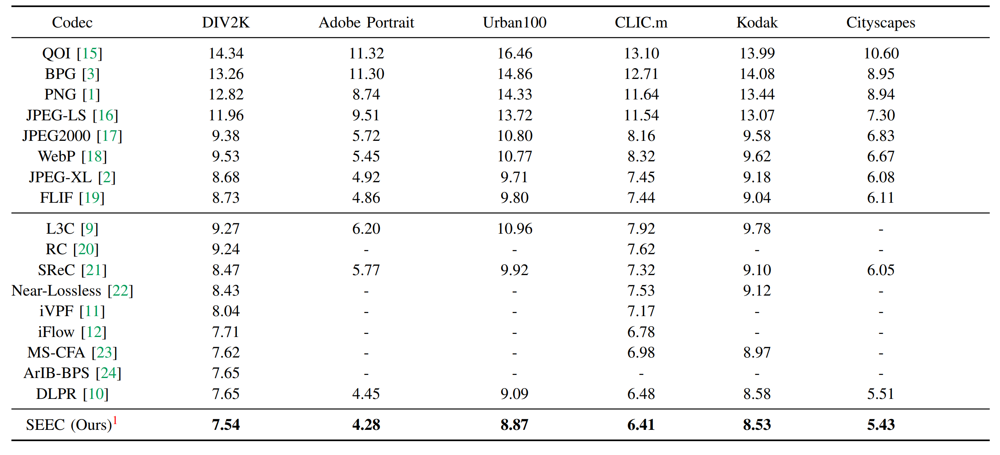

# SEEC: Segmentation-Assisted Multi-Entropy Models for Learned Lossless Image Compression
This repo is the official implementation of the paper ["SEEC: Segmentation-Assisted Multi-Entropy Models for Learned Lossless Image Compression"](https://arxiv.org/abs/2509.07704):

<div align="center">
  
</div>

<br>

<div align="center">
  
</div>

## Preparation


### Installation

A suitable conda environment named seec can be created and activated by:
```
conda create -n seec python=3.10
conda activate seec
pip install -r requirements.txt
```

### Dataset

Download the [DIV2K Train & Val HR dataset](https://data.vision.ee.ethz.ch/cvl/DIV2K/) and place it place it in your `DIV2K_TRAIN_PATH` and `DIV2K_VAL_PATH` respectively.

To prepare the dataset, run the following command, this will generate patches and mask images stored in `data` as default:
```
python prepare_data.py --div_path_train DIV2K_TRAIN_PATH --div_path_val DIV2K_VAL_PATH
```
### pre-trained models

We provide main models and (ablation models will be available soon). you can download from [PKU Disk](https://disk.pku.edu.cn/link/AA4BF8AE4F3C7D4BE8BBB5EED6C631E38F), [BaiDu NetDisk](https://pan.baidu.com/s/1Maw-VUQe6zPW2O-icmGBSA?pwd=2xcv), or [Google Drive](https://drive.google.com/drive/folders/1eFrNdaTtpadxKUTZ-i_5Pr1ZM_e9pC24?usp=drive_link)


Besides, you also need to download the pre-trained segmentation model from [BiRefNet](https://github.com/ZhengPeng7/BiRefNet), we use the [BiRefNet-general-epoch_244.pth](https://github.com/ZhengPeng7/BiRefNet/releases/download/v1/BiRefNet-general-epoch_244.pth) and place it in the `model_hub` directory.


## Usage
### Training from scratch
Example script for training the model from scratch, it takes about 5 days on a single NVIDIA A100 GPU:
```
python train.py --config seg_T_mul_T_part4_full.py
```
use different config files for training different models to disable segmentation or multi-channel LMM., the config files are in the `configs` directory.

| MEM (multi entropy model) | MCDLM (multi-channel lmm) | epoch |  config |  
|--------------------------|---------------------------|-------|---|
| ✔                        | ✔                         | 1500  |  seg_T_mul_T_part4_full.py |  
| ✔                      | ✔                            | 600   |   seg_T_mul_T_part4.py|  
| ✘                       | ✔                         | 600   |  seg_F_mul_T_part4.py |   
| ✔                        | ✘                        | 600   | seg_T_mul_F_part4.py  | 
| ✘                        | ✘                         | 600   |  seg_F_mul_F_part4.py |

### Evaluation
Given a model checkpoint, you can evaluate the negative log-likelihood (NLL) by dry-run:
```
python eval.py --ckpt PATH_TO_CHECKPOINT --imgdir PATH_TO_IMAGE_DIRECTORY --dryrun --config CONFIG_FILE
```
or evaluate the actual bpp and runtime of compressing and decompressing the images:
```
python eval.py --ckpt PATH_TO_CHECKPOINT --imgdir PATH_TO_IMAGE_DIRECTORY --config CONFIG_FILE
```
You can evaluate on multiple directories by specifying `--imgdir` multiple times:
```
python eval.py --ckpt PATH_TO_CHECKPOINT --imgdir PATH_TO_IMAGE_DIRECTORY_1 PATH_TO_IMAGE_DIRECTORY_2 --config CONFIG_FILE
```

Encoding and decoding a single image separately can be done by:
```
python encode.py --ckpt PATH_TO_CHECKPOINT --i PATH_TO_IMAGE --o PATH_TO_OUTPUT_BITSTREAM --config CONFIG_FILE
python decode.py --ckpt PATH_TO_CHECKPOINT --i PATH_TO_INPUT_BITSTREAM --o PATH_TO_OUTPUT_IMAGE --config CONFIG_FILE
```


## Citation
If you find our work useful in your research, please consider citing the following paper:
```
@article{zheng2025seec,
  title={SEEC: Segmentation-Assisted Multi-Entropy Models for Learned Lossless Image Compression},
  author={Zheng, Chunhang and Ren, Zichang and Li, Dou},
  journal={arXiv preprint arXiv:2509.07704},
  year={2025}
}
```

If you use our codebase, please consider also citing [DLPR](https://github.com/BYchao100/Deep-Lossy-Plus-Residual-Coding), [BiRefNet](https://github.com/ZhengPeng7/BiRefNet) and [L3C](https://github.com/fab-jul/L3C-PyTorch).

## Acknowledgment
This code is built on top of [CompressAI](https://github.com/InterDigitalInc/CompressAI). This repo refers the nn modules from [DLPR](https://github.com/BYchao100/Deep-Lossy-Plus-Residual-Coding), entropy coding from [torchac](https://github.com/fab-jul/torchac), segmentation network from [BiRefNet](https://github.com/ZhengPeng7/BiRefNet).